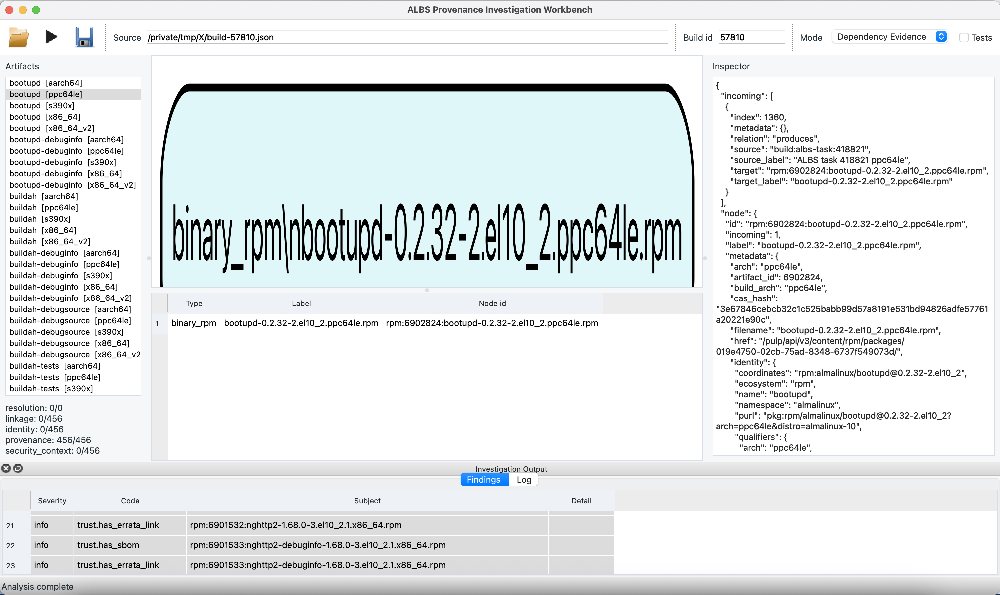
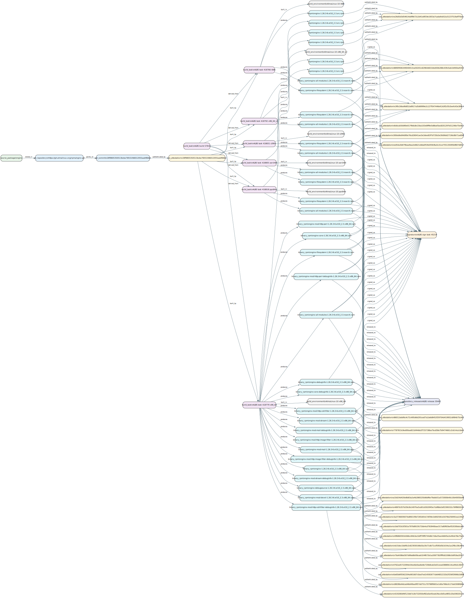

# albs-provenance-explorer

`albs-provenance-explorer` is a read-only Python PoC that builds a provenance-aware graph over AlmaLinux Build System (ALBS), RPM, SBOM, CAS and errata data.

It traces Enterprise Linux supply-chain lineage from source package to shipped artifact and layers a conflict-aware dependency model on top. Release context, errata linkage and build provenance sit next to the raw package relationships, so backported security fixes stay visible - a version that looks older than upstream can still carry the patch.

ALBS is the provenance backbone:

```text
source package
  -> git repository
  -> exact git commit
  -> Codenotary CAS source attestation
  -> ALBS build task
  -> build environment
  -> SRPM / binary RPM
  -> Codenotary CAS artifact attestation
  -> signature
  -> repository release
  -> SBOM
  -> errata / CVE
```

## PyQt investigation workbench

The `InvestigationWorkbenchApp` branch also exposes the same backend through a
desktop workbench:

```bash
pip install -e '.[dev,gui]'
albs-graph-workbench
```

It opens cached ALBS metadata or a live build id, runs the shared
`AnalysisService`, lists RPM artifacts, renders focused graph slices, and lets
you inspect node metadata, incoming/outgoing evidence and findings without
leaving the graph.




## Demo: full feature run on build 57810 (AlmaLinux 10)

`example--full.sh` runs almost the whole feature set end to end against a live build and writes README-ready artifacts. It defaults to AlmaLinux 10 build [`57810`](https://build.almalinux.org/build/57810) - a 13-source batch (buildah, crun, dnsmasq, grafana, grafana-pcp, krb5, nghttp2, nginx, opentelemetry-collector, rsync, rust-bootupd, skopeo, toolbox) of 456 binary RPMs - focused on `nginx-core`. One command, on a real AlmaLinux 10 host:

```text
[almalinux@host albs-provenance-explorer]$ bash example--full.sh
== albs-provenance-explorer :: comprehensive demo ==
build=57810  package=nginx-core  arch=x86_64  file=/usr/sbin/nginx  repo=appstream
tools: dnf=yes rpmkeys=yes cas=no dot=yes git=yes zstandard=yes

========== Fetch ALBS build metadata (cached examples/live-build-57810/build-57810.albs.json) ==========
step Loading ALBS build metadata from fresh cache examples/live-build-57810/build-57810.albs.json
step Source package: nghttp2 (from ALBS srpm_artifact)
step Building provenance graph from ALBS metadata
step Graph: 1613 nodes, 2775 edges, 470 CAS attestations
step Writing json output to examples/live-build-57810/build-57810.json

========== 1. Provenance: source-to-artifact trust path for nginx-core ==========
step Attaching build SBOM examples/build-57810.cyclonedx.json to the build's RPMs
step build SBOM matched 456 RPMs, set 456 vendor CPEs from build-57810.cyclonedx.json
step Selected RPM node: rpm:6901620:nginx-core-1.26.3-6.el10_2.3.x86_64.rpm
               Trust path:                
 nginx-core-1.26.3-6.el10_2.3.x86_64.rpm  
┏━━━━━━━━━━━━━━━━━━━━━━━━━━━━━━┳━━━━━━━━━┓
┃ Check                        ┃ Result  ┃
┡━━━━━━━━━━━━━━━━━━━━━━━━━━━━━━╇━━━━━━━━━┩
│ has_build_task               │ ok      │
│ has_signature                │ ok      │
│ has_release                  │ ok      │
│ has_source_cas_attestation   │ ok      │
│ has_artifact_cas_attestation │ ok      │
│ has_sbom                     │ ok      │
│ has_errata_link              │ missing │
└──────────────────────────────┴─────────┘
Provenance complete: True
Security context complete: False
Missing security context: has_errata_link

========== 2. Point at a binary file: full lineage of /usr/sbin/nginx ==========
│ source_package           │ nginx                                                            │
│ git_commit               │ 28f9805350513bcbe76fc51fd6012055aabf66bd                         │
│ build_task               │ ALBS task 418779 x86_64                                          │
│ binary_rpm               │ nginx-core-1.26.3-6.el10_2.3.x86_64.rpm                          │
│ srpm                     │ nginx-1.26.3-6.el10_2.3.src.rpm                                  │
│ signature                │ ALBS sign task 45219                                             │
│ repository_release       │ ALBS release 35402                                               │
│ cas_artifact_attestation │ 300eb6e84d90e76cd26041ae3e3dee83f7d735b3e30d9dd2719dc8b71ad04fef │
│ sbom                     │ build-57810.cyclonedx.json                                       │

========== 3. Five-axis coverage up the cost ladder (headers, payload ELF, dnf, sonames, GPG sigs, CAS, CPE) ==========
step build SBOM matched 456 RPMs, set 456 vendor CPEs from build-57810.cyclonedx.json
step Resolving dependencies per package with dnf repoquery
step Range-reading RPM headers for dynamic-linkage claims
step Downloading RPM payloads and parsing ELF objects (rung 4)
step analyzed 1 ELF objects in nginx-core-1.26.3-6.el10_2.3.x86_64.rpm
step Resolving sonames to packages via dnf --whatprovides
step Verifying RPM GPG signatures (download + rpmkeys --checksig)
step Reconciling dependency claims
         Provenance coverage (five axes)         
┏━━━━━━━━━━━━━━━━━━┳━━━━━━━━━┳━━━━━━━┳━━━━━━━━━━┓
┃ Axis             ┃ Covered ┃ Total ┃ Fraction ┃
┡━━━━━━━━━━━━━━━━━━╇━━━━━━━━━╇━━━━━━━╇━━━━━━━━━━┩
│ resolution       │       5 │    14 │     0.36 │
│ linkage          │       1 │   456 │     0.00 │
│ identity         │     456 │   456 │     1.00 │
│ provenance       │     456 │   456 │     1.00 │
│ security_context │       0 │   456 │     0.00 │
└──────────────────┴─────────┴───────┴──────────┘
dnf repoquery: 6 runtime + 1 weak resolved claims across 2 packages
soname resolution: 6/6 sonames mapped to packages, 5 provider claims added
Build SBOM (alma-sbom): matched 456 RPMs, set 456 vendor CPEs from 457 components
Identity strength: 456 vendor-asserted (alma-sbom)
RPM header enrichment: 1/1 headers fetched, 8 dynamic-linkage claims added
RPM license (from header): nginx-core=BSD-2-Clause
RPM payload analysis: 1/1 payloads, 1 ELF objects, 6 NEEDED claims, 0 static objects, 0 Go module claims
Signatures: 1 verified, 0 nokey, 0 failed of 1 RPMs
Reconciled dependencies: 14; conflicts: 1
  agreements: insufficient_evidence=8, consensus=5, conflict=1
  rpm:6901620:nginx-core-1.26.3-6.el10_2.3.x86_64.rpm:
    rpm:almalinux/glibc @ 0:2.39-121.el10_2.alma.1, 0:2.39-124.el10_2.alma.1 -> conflict [dnf:requires, soname_provider]
    rpm:almalinux/libxcrypt @ 0:4.4.36-10.el10 -> consensus [dnf:requires, soname_provider]
    rpm:almalinux/nginx-filesystem @ 2:1.26.3-6.el10_2.3 -> consensus [dnf:recommends, dnf:requires]
    rpm:almalinux/openssl-libs @ 1:3.5.5-2.el10_2.alma.1 -> consensus [dnf:requires, soname_provider]
    rpm:almalinux/pcre2 @ 0:10.44-1.el10.3 -> consensus [dnf:requires, soname_provider]
    rpm:almalinux/zlib-ng-compat @ 0:2.2.3-3.el10_1 -> consensus [dnf:requires, soname_provider]
    rpm:libc.so.6 -> insufficient_evidence [elf_dt_needed, rpm_header_soname]
    rpm:libcrypto.so.3 -> insufficient_evidence [elf_dt_needed, rpm_header_soname]
    rpm:libssl.so.3 -> insufficient_evidence [elf_dt_needed, rpm_header_soname]
    ... (libcrypt.so.2, libpcre2-8.so.0, libz.so.1, nginx-filesystem, openssl-libs also insufficient_evidence) ...
  [version_drift] rpm:almalinux/glibc: versions=0:2.39-121.el10_2.alma.1, 0:2.39-124.el10_2.alma.1

========== 4. License rollup (real RPM licenses: subject from header in step 3, deps via dnf) ==========
step dnf: 6 resolved runtime providers for nginx-core
6 distinct licenses across 7 packages; 0 unknown (nginx-core + 6 runtime deps)

========== 5. Vulnerability-applicability report ==========
┃ Package              ┃ Arch   ┃ Identity        ┃ Addressed CVEs ┃ Potential CVEs ┃ Reachability ┃
│ nginx-core           │ x86_64 │ vendor_asserted │ -              │ -              │ dynamic      │
│ nginx-core-debuginfo │ x86_64 │ vendor_asserted │ -              │ -              │ dynamic      │
2 packages; 0 addressed, 0 potentially-affected distinct CVEs

========== 6. Real CycloneDX SBOM ingest (from AlmaLinux alma-sbom, no fake data) ==========
   imported 433 package nodes + 433 edges from a real alma-sbom build SBOM
   source: examples/build-57810.cyclonedx.json (regenerate: alma-sbom --file-format cyclonedx-json build --build-id 57810)

========== 7. Native dependency resolution (language manifest -> go list / cargo metadata / ...) ==========
   (skipped: set RESOLVE_ECOSYSTEM=go|cargo|pypi|npm and RESOLVE_MANIFEST=<go.mod|...>;
            needs the native tool on PATH -- an RPM build carries no language manifest itself)

========== 8. Checkout the exact ALBS git source commit, then analyze source evidence ==========
Checked out nginx source at 28f9805350513bcbe76fc51fd6012055aabf66bd to examples/live-build-57810/src-nginx
step Source evidence: 35 files, 0 manifests, 1 spec files, 48 dependencies
step Source imports: 0 files scanned, 0 distinct imports, 0 claims added
      Source Evidence       
┏━━━━━━━━━━━━━━━━━━┳━━━━━━━┓
┃ Metric           ┃ Value ┃
┡━━━━━━━━━━━━━━━━━━╇━━━━━━━┩
│ files            │    35 │
│ manifests        │     0 │
│ spec_files       │     1 │
│ dependency_specs │    48 │
│ source_refs      │    22 │
│ patch_refs       │    12 │
│ ecosystems       │  none │
└──────────────────┴───────┘
Source imports: 0 distinct across 0 files (no languages detected); 0 dependency claims attached
   (the ALBS source repo is the RPM packaging: .spec + patches; upstream nginx C source lives in a separate repo - source_imports.py would scan that)

========== 9. Inspect a local RPM header (rpmfile) ==========
   (skipped: set RPM_FILE=<path/to.rpm> to inspect a local RPM header)

========== 10. SLSA / in-toto provenance attestation ==========
   wrote examples/demo-build-57810/nginx-core.intoto.json

========== 11. Build intelligence: artifact matrix + build/signing/processing timing (verbose analyzer) ==========
step ALBS build task platforms: x86_64, aarch64, ppc64le, s390x, i686, x86_64_v2
                                  ALBS RPM artifact matrix                                   
┏━━━━━━━━━━━━━━━━━┳━━━━━━━━━━━┳━━━━━━━━━━━━━━━━━━━━━━━━━━━━━━━━┳━━━━━━━━━━━━┓
┃ Build task arch ┃ Artifacts ┃ Artifact arches                ┃ Package set ┃
┡━━━━━━━━━━━━━━━━━╇━━━━━━━━━━━╇━━━━━━━━━━━━━━━━━━━━━━━━━━━━━━━━╇━━━━━━━━━━━━┩
│ x86_64          │        94 │ x86_64=76, noarch=5, src=13    │ delta (+21) │
│ i686            │        66 │ i686=48, noarch=5, src=13      │ common      │
│ src             │        13 │ src=13                         │ 13 sources  │
└─────────────────┴───────────┴────────────────────────────────┴─────────────┘
   ... (aarch64/ppc64le/s390x/x86_64_v2 rows, the 62-name common package set, and the
        90-row per-task processing timeline + signing-task timing are in console.txt) ...
step Build timing totals: wall=101.8m, aggregate task wall=412.8m, critical task wall=19.9m
            ALBS signing/notarization timing            
┏━━━━━━━━━━━┳━━━━━━━┳━━━━━━━┳━━━━━━━━━━┳━━━━━━━━┳━━━━━━┓
┃ Sign task ┃  Wall ┃  sign ┃ notarize ┃ upload ┃  web ┃
┡━━━━━━━━━━━╇━━━━━━━╇━━━━━━━╇━━━━━━━━━━╇━━━━━━━━╇━━━━━━┩
│ 45219     │ 29.8m │ 18.5m │     1.8m │   5.2m │ 2.2m │
└───────────┴───────┴───────┴──────────┴────────┴──────┘
step Writing artifact inventory + processing analysis json to examples/demo-build-57810/
step Selected RPM node: rpm:6901620:nginx-core-1.26.3-6.el10_2.3.x86_64.rpm
step Analyzing source-to-artifact trust path  (build SBOM attached, same as step 1)
               Trust path:                
 nginx-core-1.26.3-6.el10_2.3.x86_64.rpm  
┏━━━━━━━━━━━━━━━━━━━━━━━━━━━━━━┳━━━━━━━━━┓
┃ Check                        ┃ Result  ┃
┡━━━━━━━━━━━━━━━━━━━━━━━━━━━━━━╇━━━━━━━━━┩
│ has_build_task               │ ok      │
│ has_signature                │ ok      │
│ has_release                  │ ok      │
│ has_source_cas_attestation   │ ok      │
│ has_artifact_cas_attestation │ ok      │
│ has_sbom                     │ ok      │
│ has_errata_link              │ missing │
└──────────────────────────────┴─────────┘
Missing security context: has_errata_link
==> Done

========== 12. Render graphs to SVG (full build, focused trust path, whole-source fan-out) ==========
   wrote examples/demo-build-57810/build-57810.svg (full build graph)
   wrote examples/demo-build-57810/nginx-core-57810-trust.svg (focused trust path)
   wrote examples/demo-build-57810/nginx-core-source-build-57810.svg (source build fan-out: one source -> all its RPMs)

========== 13. Offline synthetic fixture (no network): build, render, inspect ==========
   wrote examples/live-build-57810/fixture-demo-pkg.json (synthetic graph)
   wrote examples/demo-build-57810/fixture-demo-pkg.svg (synthetic graph SVG)
demo-pkg.x86_64.rpm: provenance complete=True, security context complete=False

========== 14. Dependency universe via 'dnf repograph appstream' (build, persist, traverse) ==========
Saved universe to examples/live-build-57810/universe-appstream.db: 4398 nodes, 11720 edges
Universe: 4398 nodes, 11720 edges (4398 packages)
Most-depended-upon packages (direct dependents = blast radius):
    375  perl-libs
    366  texlive-kpathsea
    323  texlive-base
   wrote examples/demo-build-57810/universe-nginx-core-deps-57810.svg (nginx-core dependency neighbourhood)

== Done. Artifacts in examples/demo-build-57810: console.txt, *.svg, *.json, nginx-core.intoto.json ==
[almalinux@host albs-provenance-explorer]$
```

That single run exercises every command: the provenance trust path; `identify` (a binary file -> its full creation/install lineage); five-axis coverage up the cost ladder (RPM headers, payload ELF, `dnf repoquery`, soname -> providing package, GPG signatures, CAS, CPE); a real **license rollup** (the RPM `License:` tag + `dnf repoquery %{license}`); the `vuln` report; whole-SBOM `import-sbom` ingest of the real AlmaLinux [`alma-sbom`](https://github.com/AlmaLinux/alma-sbom) CycloneDX; `source-evidence` (checkout the exact git commit + discover ecosystem manifests); language-native `resolve`; `inspect-rpm`; the `slsa` attestation; **build intelligence** (artifact matrix + build/signing/processing timing); an offline synthetic-fixture build/render/inspect; and the dependency `universe`. Retarget with `BUILD_ID=<id> PACKAGE=<rpm> ./example--full.sh`; the full log is [`console.txt`](examples/demo-build-57810/console.txt).

The reconciler does not collapse a dependency into one edge: it groups every claim (a `dnf` requires, a soname -> provider lookup, an ELF `DT_NEEDED`, an RPM header requires) and emits a typed verdict. Here 5 runtime packages reach `consensus`, 8 bare sonames and header requires stay `insufficient_evidence` (no concrete version behind them), and `glibc` is a real `version_drift` conflict - the el10 repos currently carry two builds (`2.39-121` and `2.39-124`), so `dnf` and soname resolution legitimately disagree on the release and the reconciler records both rather than picking one. Agreement and build-context validity are tracked on separate axes: resolve an el9 build on this same el10 host and the sources still reach honest `consensus` on the el10 packages, but the resolution is tagged with a `cross_distro` context issue and dropped from resolution coverage - the reconciler refuses to pass one generation's releases off as another's dependencies, without pretending the sources disagreed.

The real `alma-sbom` SBOM (`--build-sbom`) enriches every report rather than just being imported: matched to the build's own 456 RPMs, it sets each one's vendor CPE - lifting the `identity` axis from `0.00` to `1.00`, flipping the trust path's `has_sbom` check to `ok`, and moving the `vuln` report's identities from `candidate_only` to `vendor_asserted`. That status is deliberately distinct from the `verified` an NVD-dictionary match yields: both establish a CPE and count toward identity, but the SBOM CPE is AlmaLinux asserting its own artifact's identity, not an external confirmation - so coverage reports the strength split (`Identity strength: ... vendor-asserted`) and the SBOM never overrides a stronger prior NVD verification.

The licenses are real too. `nginx-core`'s `License:` tag (`BSD-2-Clause`) is read straight from the range-fetched RPM header, and `license --rpm-licenses` rolls up the subject plus its 6 resolved runtime deps into 6 distinct licenses via `dnf repoquery %{license}` - no SBOM needed. AlmaLinux's own [`alma-sbom`](https://github.com/AlmaLinux/alma-sbom) *does* generate a real CycloneDX build SBOM anonymously (`alma-sbom --file-format cyclonedx-json build --build-id 57810` -> 457 components with real PURLs, CPEs and hashes), but its components carry no license field, so the demo ingests that SBOM ([`import-sbom`](examples/build-57810.cyclonedx.json), 433 package nodes) for its provenance data and reads licenses from the RPM evidence instead. Nothing here is fabricated.

Focused source-to-artifact trust path for `nginx-core` (correctly rooted at the **nginx** source, not the batch's first package):


One level out, the whole **nginx** source package's build fan-out (`trust-path --whole-source`): a single shared backbone - source -> git commit -> CAS -> build task -> SRPM - producing all of nginx's `x86_64` RPMs, each signed and released (72 nodes, the readable slice of the 1613-node full build):



`nginx-core`'s dependency neighbourhood in the AppStream universe:


<details>
<summary>Full build provenance graph for all of 57810 - 456 binary RPMs across 13 source packages, 3.2 MB (large; the nginx fan-out above is the readable slice of it)</summary>


</details>

Also produced: the [SLSA / in-toto attestation](examples/demo-build-57810/nginx-core.intoto.json) and the full [console log](examples/demo-build-57810/console.txt).

## Scope

Status is tracked in three honest buckets. "Couldn't resolve" is a deliverable here: the coverage report always names the unresolved residue rather than claiming 100%.

### Implemented

- provenance graph core with canonical ALBS/RPM node and edge types, plus the source-to-artifact trust path for binary RPMs
- normalized, conflict-aware dependency **claim/reconcile** model: one claim per evidence source, reconciled into a verdict without discarding the losing claims, surfaced through a five-axis coverage report (`resolution`, `linkage`, `identity`, `provenance`, `security_context`)
- live `build.almalinux.org` metadata adapter (on-disk cache + TTL), artifact inventory and processing-timeline analysis
- RPM header reads over HTTP Range (rung 3): `DT_NEEDED` sonames become dynamic-linkage claims without downloading the payload
- full payload ELF analysis (rung 4): a dependency-free ELF parser recovers `DT_NEEDED`, RPATH/RUNPATH, dynamic-vs-static, `dlopen`, toolchain, and a static Go module BOM from `.go.buildinfo`
- soname → providing-package resolution, and deep `dnf repoquery` extraction (versioned runtime deps, weak deps as optional, conflicts/obsoletes, `--whatprovides`)
- AlmaLinux-native RPM resolution (rung 5): `dnf repograph` / `rpmgraph` dot ingest emits resolved RPM dependency claims
- real native resolvers for **Go** (`go list -m all`) and **Cargo** (`cargo metadata`) behind the typed resolver contract
- Python language evidence: `requirements.txt` plus import scanning produce PyPI claims (pinned versions count toward resolution)
- multi-language source-tree import scanning (`adapters/source_imports.py`, `source-evidence` default-on / `--no-scan-imports`): walks the checked-out tree, detects each file's language by extension (with shebang fallback), and emits per-language declared-dependency claims for Python, Go, Rust, C/C++, JS/TS, Java, Ruby - stdlib filtered per language, project-internal references (`require_relative`, `./relative` JS imports, `self::`/`super::`/`crate::` in Rust) excluded
- dependency **universe**: repo-wide graph build, traversal (`dependents_of` / `dependencies_of` / `dependency_paths`), cross-repo merge, and focused-subgraph visualization
- low-footprint SQLite persistence: build once, query later; one-hop queries run in SQL without loading the whole graph (stdlib only, no graph DB)
- SPDX/CycloneDX SBOM import (incl. real multi-arch AlmaLinux `alma-sbom` build SBOMs - arch variants kept distinct); a build SBOM also enriches the build's own RPMs in place (`--build-sbom`): the vendor CPE per RPM (lifts the `identity` axis to 1.00), PURL/hash, and an SBOM link. Plus errata/CVE attachment, CPE verification against a supplied dictionary (with the AlmaLinux distro-backport flag), GPG signature verification (`rpmkeys --checksig`), and optional CAS verification (`--use-cas`)
- real license rollup with no SBOM required: the RPM `License:` header tag (rung 3) plus `dnf repoquery %{license}` over a package and its resolved runtime deps (`license --rpm-licenses`); an SBOM-based rollup (`license --sbom`) remains for CycloneDX files that carry licenses
- consumer reports: `vuln` applicability (with `--cve-feed` rpmvercmp range matching), the `license` rollup, and `slsa` in-toto / SLSA provenance export
- PURL / CPE / CAS identities kept strictly separate; JSON, DOT and SVG rendering; a CLI covering all of the above

### Partial

- Python dependencies are recorded from `requirements.txt` and import scanning, but without a real pip/uv resolver - no transitive closure or environment-marker evaluation
- CPE verification and CVE-feed matching consume **supplied** dictionary/feed files; there is no live NVD or errata fetch yet
- vault URL reconstruction is a heuristic over known AlmaLinux repo layouts, not an exhaustive mirror map
- SQLite is a deliberately lightweight persistence layer for the PoC, not the final production graph platform

### Future

- real resolvers for **pip/uv**, **Poetry**, **Maven/Gradle** and **npm** behind the existing contract
- sandboxed resolver execution; registry snapshot / cache invalidation (yanks, deletions) rather than age-based TTL
- parallel and cached header/payload/SBOM fetches; incremental re-reconciliation
- a heavier backend (Postgres recursive CTEs or a dedicated graph store) only if the SQLite store is outgrown

Permanent non-goals: implementing our own SAT/backtracking solver (we delegate to native tools), write access to ALBS, a web platform, Kubernetes or service deployment, and replacing distro build or signing infrastructure.

## Install

```bash
python3 -m venv .venv
. .venv/bin/activate
pip install -e '.[dev]'
```

Graphviz is required for SVG rendering:

```bash
dot -V
```

Optional native tools unlock higher rungs and degrade gracefully when absent (every one is a no-op, never fatal): `dnf` / `rpmgraph` (rung 5 resolution, soname->package, `%{license}`), `rpmkeys` (GPG signature verification), `dot` (SVG), and AlmaLinux's [`alma-sbom`](https://github.com/AlmaLinux/alma-sbom) (`pipx install --system-site-packages git+https://github.com/AlmaLinux/alma-sbom.git`) to generate a real CycloneDX SBOM for a build. `alma-sbom` reads AlmaLinux's immudb anonymously (its wrapper ships default read credentials); the SBOMs it returns carry provenance (PURL/CPE/hash) but no per-component licenses, which is why licenses are read from the RPM evidence instead.

## CLI

List available commands and options:

```bash
albs-graph --help
albs-graph fetch --help
albs-graph trust-path --help
```

If the console script is not installed in the active virtual environment, use the module entrypoint:

```bash
python -m albs_graph.cli.main --help
```

Fetch and parse an ALBS build page:

```bash
albs-graph fetch-build 12345 --format json
```

Show step-by-step fetch, CAS extraction and render progress on stderr:

```bash
albs-graph fetch --build-id 57810 --cache examples/live-build-57810/build-57810.albs.json --format json --verbose -o build-57810.json
albs-graph trust-path --build-id 57810 --cache examples/live-build-57810/build-57810.albs.json --format svg --verbose -o build-57810-derived-trust.svg
```

### One comprehensive demo

`example--full.sh` is the single end-to-end demo: it exercises every command and feature on one build (default el10 `57810` / `nginx-core`), each step gated so a missing tool, file, or network connection skips rather than fails. See the **Demo** section above for the annotated run; retarget with `BUILD_ID=<id> PACKAGE=<rpm> ./example--full.sh`.

Beyond the report commands it surfaces **build intelligence** (the `demo_verbose` analyzer, step 11): every ALBS build-task platform, an RPM artifact matrix, and build/signing/processing timing - written as [`build-57810-artifact-inventory.json`](examples/demo-build-57810/build-57810-artifact-inventory.json) and [`build-57810-processing-analysis.json`](examples/demo-build-57810/build-57810-processing-analysis.json). The wrapper is thin; fetching, graph construction, inventory, timing analysis and rendering all live in Python (`python3 -m albs_graph.cli.demo_verbose`).

**Resolution fidelity follows the *resolving host's* repos.** `dnf` and soname resolution attach whatever versions that host can see, so the most faithful results come from matching the host to the build's distro. On an AlmaLinux 10 host, point the demo at an el10 build; resolving an el9 build on an el10 host yields host-distro providers that the reconciler flags as a `cross_distro` context issue (and drops from resolution coverage) rather than passing them off as the build's deps.

Inspect local RPM metadata:

```bash
albs-graph inspect-rpm ./bash.rpm --format json
```

Import an SBOM - the repo ships a real `alma-sbom` build SBOM for 57810 (SPDX or CycloneDX JSON):

```bash
albs-graph import-sbom examples/build-57810.cyclonedx.json --format dot
```

Show a focused trust graph for one RPM artifact from a live ALBS build:

```bash
albs-graph trust-path --build-id 57810
albs-graph trust-path --build-id 57810 --arch x86_64
albs-graph trust-path --build-id 57810 --rpm nginx-core --arch x86_64
albs-graph trust-path --build-id 57810 --rpm nginx-core --arch x86_64 --format svg -o nginx-core-x86_64-trust.svg
```

Checkout and analyze source evidence referenced by an ALBS build:

```bash
albs-graph checkout-source --build-id 57810 --package nginx --dest sources/nginx
albs-graph source-evidence sources/nginx --build-id 57810 --package nginx --format json -o nginx-source-evidence.json
```

`source-evidence` starts from ALBS build metadata, attaches a hashed source-file inventory, parses RPM `.spec` files for `BuildRequires`, `Requires`, `Source` and `Patch`, and records detected ecosystem manifests such as `package.json`, `Cargo.toml`, `go.mod`, `pyproject.toml`, `pom.xml` and Gradle build files. Manifest *detection* is evidence, not resolution; the separate `resolve` command runs native resolvers (Go and Cargo today) that consume those manifests and emit resolved dependency facts.

## Coverage, enrichment and analysis

The commands above build and inspect the provenance backbone; these realize the five coverage axes and the cost ladder, and project the graph for each consumer. All take either a live `--build-id` or a cached `--source` metadata JSON (shown here as `CACHE`).

Five-axis coverage, then climb the cost ladder: rung 3 reads RPM headers over HTTP Range, rung 4 downloads full payloads and parses ELF (both network):

```bash
albs-graph coverage --source examples/live-build-57810/build-57810.albs.json
albs-graph coverage --source CACHE --with-rpm-headers --arch x86_64 --limit 5
albs-graph coverage --source CACHE --with-rpm-payloads --package nginx-core --arch x86_64
```

AlmaLinux-native resolution (rung 5; needs `dnf`/`rpmgraph` on the host, otherwise a graceful no-op):

```bash
albs-graph coverage --source CACHE --use-dnf --package nginx-core --arch x86_64
albs-graph coverage --source CACHE --repograph appstream --arch x86_64
albs-graph coverage --source CACHE --repograph-dot appstream.dot
albs-graph coverage --source CACHE --resolve-sonames --arch x86_64
```

Attach evidence and run real verification (these move the `security_context` and `identity` axes):

```bash
albs-graph coverage --source CACHE --build-sbom examples/build-57810.cyclonedx.json   # vendor CPEs -> identity axis
albs-graph coverage --source CACHE --sbom sbom.json --sbom-subject nginx-core
albs-graph coverage --source CACHE --requirements requirements.txt
albs-graph coverage --source CACHE --errata errata.json --verify-cpe cpe-dict.json
albs-graph coverage --source CACHE --verify-signatures --arch x86_64
albs-graph coverage --source CACHE --use-cas
```

Trace any installed file back through its full lineage (source -> commit -> build -> RPM -> signature -> release -> deps):

```bash
albs-graph identify /usr/sbin/nginx --source CACHE
```

Build a repo-wide dependency **universe**, persist it to a low-footprint SQLite store, and traverse it (one-hop queries run in SQL without loading the whole graph):

```bash
albs-graph universe --repograph-dot appstream.dot --repograph-dot baseos.dot --save universe.db
albs-graph universe --db universe.db --dependents-of libcrypto.so.3
albs-graph universe --db universe.db --path-from nginx-core --path-to glibc --format svg -o path.svg
```

Resolve a language manifest with its native tool (Go `go list -m all`, Cargo `cargo metadata`) behind the resolver contract:

```bash
albs-graph resolve --ecosystem go --manifest ./go.mod
albs-graph resolve --ecosystem cargo --manifest ./Cargo.toml --source CACHE --subject mypkg
```

Consumer reports projected from the same graph: vulnerability applicability, license rollup, and SLSA/in-toto provenance:

```bash
albs-graph vuln --source CACHE --errata errata.json --verify-cpe cpe-dict.json --cve-feed cve-feed.json
albs-graph license --source CACHE --rpm-licenses --package nginx-core --arch x86_64   # real licenses (header + dnf), no SBOM
albs-graph license --source CACHE --sbom sbom.json --sbom-subject nginx-core          # or roll up a CycloneDX SBOM that carries licenses
albs-graph slsa nginx-core --source CACHE -o nginx-core.intoto.json
```

## Model

Canonical node types include:

`source_package`, `git_repository`, `git_commit`, `cas_attestation`, `build_task`, `build_environment`, `srpm`, `binary_rpm`, `signature`, `repository_release`, `errata`, `cve`, `sbom`, `external_package`, `dependency_spec`, `source_tree`, `source_file`, `source_manifest`.

Canonical edge types include:

`stored_in`, `points_to`, `authenticated_by`, `built_by`, `produces`, `tested_by`, `signed_as`, `released_to`, `described_by`, `fixes`, `affected_by`, `derived_from`, `declares_dependency`, `requires_runtime`, `requires_buildtime`, `provides`, `contains`, `references`.

Provenance edges (`built_by`, `produces`, `signed_as`, `released_to`, `authenticated_by`, `derived_from`) are primary; runtime relationships like `requires_runtime` are facts the graph carries alongside them.

## Dependency Intelligence Model

The dependency model is a typed contract with real resolvers behind it for RPM (`dnf`/`rpmgraph`), Go and Cargo, and the same contract ready for the rest. It carries:

- package identity: ecosystem, namespace, name, version, PURL and qualifiers
- dependency semantics: requested constraint, scope, linkage and resolution state
- context: OS, architecture, distro, language version, extras, profiles and feature flags
- evidence source: RPM metadata, SBOM component, lockfile or future package-manager adapter

Pip markers, Poetry extras, Maven scopes, Gradle configurations, npm optional dependencies, Cargo features and Go module constraints carry different meanings, so the graph stores each dependency fact in a normalized shape while preserving its ecosystem-specific raw metadata for auditability.

Current adapters populate this model from RPM `requires`/`provides`, RPM header and payload ELF facts, `dnf repoquery`/`repograph`/`rpmgraph` output, native Go/Cargo resolvers, Python requirements and imports, SPDX/CycloneDX components and source `.spec` declarations. Source manifest detection records ecosystem evidence wherever a corresponding file (`package.json`, `pom.xml`, Gradle build files, and so on) exists in the source tree. Remaining resolver adapters (pip/uv, Poetry, Maven/Gradle, npm) plug into the same contract without changing the ALBS provenance graph.

## Identity Model: PURL vs CPE vs ALBS/CAS

The graph keeps package identity, security matching identity and provenance evidence separate:

- PURL identifies package coordinates for SRPM/RPM and SBOM components. Live ALBS RPM artifacts now carry `pkg:rpm/almalinux/...` Package URLs with `arch`, `distro` and available version/release qualifiers, following the [Package URL](https://github.com/package-url/purl-spec) shape (`scheme:type/namespace/name@version?qualifiers`).
- CPE is security-applicability identity. The graph stores `cpe: null` plus unverified `cpe_candidates` (derived from RPM name/version) and asserts an official [CPE](https://cpe.mitre.org/specification/) dictionary match only once `coverage --verify-cpe` confirms one against a supplied dictionary, flagging AlmaLinux backports along the way.
- ALBS/CAS identity is provenance evidence. CAS nodes preserve build and notarization attributes such as `build_id`, `source_type`, `alma_commit_sbom_hash`, `git_url`, `git_ref`, `git_commit`, `build_arch`, RPM header fields, `build_host`, `built_by` and `sbom_api_ver`, matching the [AlmaLinux SBOM/Codenotary RFE](https://github.com/AlmaLinux/build-system-rfes/blob/master/SBOM/SBOM.md) fields where ALBS exposes them.

PURL answers "which package coordinate is this?", CPE answers "which security product record might apply?", and ALBS/CAS answers "what build/source/artifact evidence produced this thing?".

## Unified Graph Strategy

The system separates three concerns that are often conflated in dependency graph tools:

- provenance backbone: ALBS source, build, artifact, signature, release and CAS evidence
- dependency facts: normalized package identities, scopes, constraints, contexts and observed components
- resolver implementations: ecosystem-specific logic behind a typed contract - implemented for RPM (`dnf`/`rpmgraph`), Go and Cargo; Pip, Poetry, Maven, Gradle and npm still to come

The current code implements the provenance layer, RPM/SBOM/header/ELF evidence, source evidence discovery, and real resolution for the Enterprise Linux (RPM) case plus Go and Cargo. The remaining resolver layer consumes the detected project manifests and lockfiles for the other ecosystems, runs their native resolution strategies behind the same contract, and emits resolved dependency facts back into this graph.

## Trust Semantics

Trust-path reports separate source-to-artifact provenance from security context completeness:

- provenance checks cover ALBS build linkage, signature, release context and source/artifact CAS evidence
- security-context checks cover attached SBOM and errata/CVE linkage

`complete` is only true when both categories are complete. This keeps the live `nginx-core` demo honest: the ALBS provenance path is present, while SBOM and errata context remain explicit missing evidence until those inputs are attached.

## SBOM And CAS Attestation

The SBOM adapter imports SPDX JSON and CycloneDX JSON as provenance evidence using `sbom` nodes and `described_by` edges. ALBS source and RPM artifact trust evidence is modeled as `cas_attestation` nodes connected with `authenticated_by` edges, matching the Codenotary CAS/BOM shape used by AlmaLinux SBOM integration.

For live ALBS builds, the adapter preserves `alma_commit_cas_hash` on the source commit path and artifact `cas_hash` values on SRPM/RPM outputs. These fields are CAS evidence as reported by ALBS; a verification step marks them externally verified when it succeeds - `coverage --use-cas` for CAS hashes, or `coverage --verify-signatures` for GPG signatures.

## Layout

```text
albs_graph/
  model/        node, edge and graph core (canonical vocabulary)
  dependency/   normalized dependency-claim model, resolver contract, native resolvers
  adapters/     ingestion: ALBS, RPM header/payload (ELF), SBOM, errata, dnf, repograph, CAS, Python
  security/     PURL/CPE identity, CPE verification, CVE-feed matching
  provenance/   reconcile, five-axis coverage, trust path, identify, universe, vuln, license, slsa
  render/       JSON, DOT and SVG output
  store.py      low-footprint SQLite persistence for the universe
  cli/          Typer CLI commands
  examples/     synthetic build metadata fixture
tests/
```

## Development

```bash
pytest
```

The tests focus on graph correctness, trust-path semantics, SBOM import and render output. The code favors explicit models and small adapters so future ingestion work can add real ALBS/SBOM sources without changing the graph contract.
