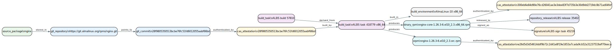
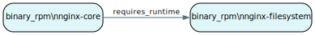

# albs-provenance-explorer

`albs-provenance-explorer` is a read-only Python PoC that builds a provenance-aware graph over AlmaLinux Build System (ALBS), RPM, SBOM, CAS and errata data.

It traces Enterprise Linux supply-chain lineage from source package to shipped artifact and layers a conflict-aware dependency model on top. Release context, errata linkage and build provenance sit next to the raw package relationships, so backported security fixes stay visible - a version that looks older than upstream can still carry the patch.

ALBS is the provenance backbone:

```text
source package
  -> git repository
  -> exact git commit
  -> Codenotary CAS source attestation
  -> ALBS build task
  -> build environment
  -> SRPM / binary RPM
  -> Codenotary CAS artifact attestation
  -> signature
  -> repository release
  -> SBOM
  -> errata / CVE
```


## Demo: full feature run on build 57810 (AlmaLinux 10)

`example--full.sh` runs almost the whole feature set end to end for one build/package and writes README-ready artifacts. It defaults to AlmaLinux 10 build [`57810`](https://build.almalinux.org/build/57810) - a 13-source batch (buildah, crun, dnsmasq, grafana, grafana-pcp, krb5, nghttp2, nginx, opentelemetry-collector, rsync, rust-bootupd, skopeo, toolbox) totalling 456 binary RPMs across 6 platforms - focused on `nginx-core`:

```bash
./example--full.sh
# retarget: BUILD_ID=<id> PACKAGE=<rpm> FILE=<path> OWNER=<rpm> ./example--full.sh
```

It exercises the provenance trust path, `identify` (a binary file -> its full creation/install lineage), five-axis coverage up the cost ladder (RPM headers, payload ELF, `dnf repoquery`, soname -> providing package, GPG signatures, CAS), the `vuln` and `slsa` reports, and the dependency `universe`. Every console line is saved to [`console.txt`](examples/demo-build-57810/console.txt) and all graphs are rendered to SVG.

On an AlmaLinux 10 host the providers resolve to matching `.el10` versions and the RPM signature verifies:

```text
resolution        3 / 14   0.21    dnf repoquery: 6 runtime + 1 weak claims
linkage           1 / 456  0.00    header 1/1 (8 sonames), payload 1/1 (6 NEEDED)
provenance      456 / 456  1.00    soname resolution: 6/6 -> providing packages
Reconciled dependencies: 14; conflicts: 3
Signatures: 1 verified, 0 nokey, 0 failed of 1 RPMs
```

The 3 conflicts are real, not contrived: the el10 repos carry two builds each of `glibc`, `openssl-libs` and `zlib-ng-compat`, so `dnf` and soname resolution legitimately disagree on the exact release, and the reconciler records every version behind a typed `version_drift` rather than picking one. There is no license rollup in this run: AlmaLinux's SBOMs need credentialed immudb access (no anonymous fetch path), so the demo ships no SBOM and never fabricates one. Supply a real CycloneDX file - e.g. from AlmaLinux's own [`alma-sbom`](https://github.com/AlmaLinux/alma-sbom) (`alma-sbom --file-format cyclonedx-json build --build-id 57810`) - to `coverage --sbom` / `license --sbom` to drive those steps.

Focused source-to-artifact trust path for `nginx-core` (correctly rooted at the **nginx** source, not the batch's first package):



`nginx-core`'s dependency neighbourhood in the AppStream universe:



<details>
<summary>Full build provenance graph for 57810 - 456 binary RPMs across 13 source packages (large)</summary>


</details>

Also produced: the [SLSA / in-toto attestation](examples/demo-build-57810/nginx-core.intoto.json) and the full [console log](examples/demo-build-57810/console.txt).

## Scope

Status is tracked in three honest buckets. "Couldn't resolve" is a deliverable here: the coverage report always names the unresolved residue rather than claiming 100%.

### Implemented

- provenance graph core with canonical ALBS/RPM node and edge types, plus the source-to-artifact trust path for binary RPMs
- normalized, conflict-aware dependency **claim/reconcile** model: one claim per evidence source, reconciled into a verdict without discarding the losing claims, surfaced through a five-axis coverage report (`resolution`, `linkage`, `identity`, `provenance`, `security_context`)
- live `build.almalinux.org` metadata adapter (on-disk cache + TTL), artifact inventory and processing-timeline analysis
- RPM header reads over HTTP Range (rung 3): `DT_NEEDED` sonames become dynamic-linkage claims without downloading the payload
- full payload ELF analysis (rung 4): a dependency-free ELF parser recovers `DT_NEEDED`, RPATH/RUNPATH, dynamic-vs-static, `dlopen`, toolchain, and a static Go module BOM from `.go.buildinfo`
- soname → providing-package resolution, and deep `dnf repoquery` extraction (versioned runtime deps, weak deps as optional, conflicts/obsoletes, `--whatprovides`)
- AlmaLinux-native RPM resolution (rung 5): `dnf repograph` / `rpmgraph` dot ingest emits resolved RPM dependency claims
- real native resolvers for **Go** (`go list -m all`) and **Cargo** (`cargo metadata`) behind the typed resolver contract
- Python language evidence: `requirements.txt` plus import scanning produce PyPI claims (pinned versions count toward resolution)
- dependency **universe**: repo-wide graph build, traversal (`dependents_of` / `dependencies_of` / `dependency_paths`), cross-repo merge, and focused-subgraph visualization
- low-footprint SQLite persistence: build once, query later; one-hop queries run in SQL without loading the whole graph (stdlib only, no graph DB)
- SPDX/CycloneDX SBOM import, errata/CVE attachment, CPE verification against a supplied dictionary (with the AlmaLinux distro-backport flag), GPG signature verification (`rpmkeys --checksig`), and optional CAS verification (`--use-cas`)
- consumer reports: `vuln` applicability (with `--cve-feed` rpmvercmp range matching), `license` rollup, and `slsa` in-toto / SLSA provenance export
- PURL / CPE / CAS identities kept strictly separate; JSON, DOT and SVG rendering; a CLI covering all of the above

### Partial

- Python dependencies are recorded from `requirements.txt` and import scanning, but without a real pip/uv resolver - no transitive closure or environment-marker evaluation
- CPE verification and CVE-feed matching consume **supplied** dictionary/feed files; there is no live NVD or errata fetch yet
- vault URL reconstruction is a heuristic over known AlmaLinux repo layouts, not an exhaustive mirror map
- SQLite is a deliberately lightweight persistence layer for the PoC, not the final production graph platform

### Future

- real resolvers for **pip/uv**, **Poetry**, **Maven/Gradle** and **npm** behind the existing contract
- sandboxed resolver execution; registry snapshot / cache invalidation (yanks, deletions) rather than age-based TTL
- parallel and cached header/payload/SBOM fetches; incremental re-reconciliation
- a heavier backend (Postgres recursive CTEs or a dedicated graph store) only if the SQLite store is outgrown

Permanent non-goals: implementing our own SAT/backtracking solver (we delegate to native tools), write access to ALBS, a web platform, Kubernetes or service deployment, and replacing distro build or signing infrastructure.

## Install

```bash
python3 -m venv .venv
. .venv/bin/activate
pip install -e '.[dev]'
```

Graphviz is required for SVG rendering:

```bash
dot -V
```

## CLI

List available commands and options:

```bash
albs-graph --help
albs-graph fetch --help
albs-graph trust-path --help
```

If the console script is not installed in the active virtual environment, use the module entrypoint:

```bash
python -m albs_graph.cli.main --help
```

Fetch and parse an ALBS build page:

```bash
albs-graph fetch-build 12345 --format json
```

Show step-by-step fetch, CAS extraction and render progress on stderr:

```bash
albs-graph fetch --build-id 57810 --cache examples/live-build-57810/build-57810.albs.json --format json --verbose -o build-57810.json
albs-graph trust-path --build-id 57810 --cache examples/live-build-57810/build-57810.albs.json --format svg --verbose -o build-57810-derived-trust.svg
```

Regenerate build-intelligence demo artifacts in one verbose run. The script fetches ALBS metadata once into a local cache, reports all ALBS build task platforms present in the build, prints an RPM artifact matrix, prints build/signing timing summaries, and reuses that metadata for JSON, DOT and SVG renders while the cache is fresh. Cache freshness defaults to 5 minutes and can be changed with `CACHE_TTL` (it defaults to build 17812 - an AlmaLinux 9 single-source nginx build; the run below targets the el10 batch 57810):

```bash
BUILD_ID=57810 RPM_NAME=nginx-core ARCH=x86_64 ./example--verbose.sh
```

<details>
<summary>Sample verbose run (`bash -x`) on an AlmaLinux host, host name sanitized</summary>

```text
[almalinux@host albs-provenance-explorer]$ BUILD_ID=57810 RPM_NAME=nginx-core ARCH=x86_64 bash -x example--verbose.sh
+ set -euo pipefail
+ BUILD_ID=57810
+ RPM_NAME=nginx-core
+ ARCH=x86_64
+ OUT_DIR=examples/demo-build-57810
+ LIVE_DIR=examples/live-build-57810
+ CACHE_FILE=examples/live-build-57810/build-57810.albs.json
+ CACHE_TTL=300
+ VERIFY_GIT=0
+ python3 -m albs_graph.cli.demo_verbose --build-id 57810 --rpm nginx-core --arch x86_64 --out-dir examples/demo-build-57810 --live-dir examples/live-build-57810 --cache examples/live-build-57810/build-57810.albs.json --cache-ttl 300 --verify-git 0
==> ALBS graph tool: albs-graph installed; using Python orchestration for single-pass demo
==> Build: 57810
==> Focused RPM selector: nginx-core.x86_64
==> Raw ALBS metadata cache: examples/live-build-57810/build-57810.albs.json
==> Cache TTL: 300s
==> Verify git source commit: 0
step Ignoring stale ALBS metadata cache examples/live-build-57810/build-57810.albs.json (4094s old, ttl 300s)
step Fetching ALBS build metadata from https://build.almalinux.org/api/v1/builds/57810/
step Writing ALBS build metadata cache to examples/live-build-57810/build-57810.albs.json
step Parsing ALBS API JSON response
step Source package: nghttp2 (from ALBS srpm_artifact)
step Building full provenance graph from ALBS metadata
step Full graph: 1613 nodes, 2775 edges, 470 CAS attestations
step ALBS build task platforms: x86_64, aarch64, ppc64le, s390x, i686, x86_64_v2
step ALBS source build task: src
step Common RPM package set applies to build task platforms: x86_64, aarch64, ppc64le, s390x, i686, x86_64_v2
            Common RPM package set            
┏━━━━┳━━━━━━━━━━━━━━━━━━━━━━━━━━━━━━━━━━━━━━━┓
┃  # ┃ Packages                              ┃
┡━━━━╇━━━━━━━━━━━━━━━━━━━━━━━━━━━━━━━━━━━━━━━┩
│  1 │ buildah                               │
│  2 │ crun                                  │
│  3 │ dnsmasq                               │
│  4 │ dnsmasq-debuginfo                     │
│  5 │ dnsmasq-debugsource                   │
│  6 │ dnsmasq-langpack                      │
│  7 │ dnsmasq-utils                         │
│  8 │ dnsmasq-utils-debuginfo               │
│  9 │ grafana                               │
│ 10 │ grafana-pcp                           │
│ 11 │ krb5                                  │
│ 12 │ krb5-debuginfo                        │
│ 13 │ krb5-debugsource                      │
│ 14 │ krb5-devel                            │
│ 15 │ krb5-libs                             │
│ 16 │ krb5-libs-debuginfo                   │
│ 17 │ krb5-pkinit                           │
│ 18 │ krb5-pkinit-debuginfo                 │
│ 19 │ krb5-server                           │
│ 20 │ krb5-server-debuginfo                 │
│ 21 │ krb5-server-ldap                      │
│ 22 │ krb5-server-ldap-debuginfo            │
│ 23 │ krb5-tests                            │
│ 24 │ krb5-workstation                      │
│ 25 │ krb5-workstation-debuginfo            │
│ 26 │ krb5-xrealmauthz                      │
│ 27 │ krb5-xrealmauthz-debuginfo            │
│ 28 │ libkadm5                              │
│ 29 │ libkadm5-debuginfo                    │
│ 30 │ libnghttp2                            │
│ 31 │ libnghttp2-debuginfo                  │
│ 32 │ libnghttp2-devel                      │
│ 33 │ nghttp2                               │
│ 34 │ nghttp2-debuginfo                     │
│ 35 │ nghttp2-debugsource                   │
│ 36 │ nginx                                 │
│ 37 │ nginx-all-modules                     │
│ 38 │ nginx-core                            │
│ 39 │ nginx-core-debuginfo                  │
│ 40 │ nginx-debuginfo                       │
│ 41 │ nginx-debugsource                     │
│ 42 │ nginx-filesystem                      │
│ 43 │ nginx-mod-devel                       │
│ 44 │ nginx-mod-http-image-filter           │
│ 45 │ nginx-mod-http-image-filter-debuginfo │
│ 46 │ nginx-mod-http-perl                   │
│ 47 │ nginx-mod-http-perl-debuginfo         │
│ 48 │ nginx-mod-http-xslt-filter            │
│ 49 │ nginx-mod-http-xslt-filter-debuginfo  │
│ 50 │ nginx-mod-mail                        │
│ 51 │ nginx-mod-mail-debuginfo              │
│ 52 │ nginx-mod-stream                      │
│ 53 │ nginx-mod-stream-debuginfo            │
│ 54 │ opentelemetry-collector               │
│ 55 │ rsync                                 │
│ 56 │ rsync-daemon                          │
│ 57 │ rsync-debuginfo                       │
│ 58 │ rsync-debugsource                     │
│ 59 │ rsync-rrsync                          │
│ 60 │ rust-bootupd                          │
│ 61 │ skopeo                                │
│ 62 │ toolbox                               │
└────┴───────────────────────────────────────┘
                                  ALBS RPM artifact matrix                                   
┏━━━━━━━━━━━━━━━━━┳━━━━━━━━━━━┳━━━━━━━━━━━━━━━━━━━━━━━━━━━━━━━━┳━━━━━━━━━━━━━━━━━━━━━━━━━━━━┓
┃ Build task arch ┃ Artifacts ┃ Artifact arches                ┃ Package set                ┃
┡━━━━━━━━━━━━━━━━━╇━━━━━━━━━━━╇━━━━━━━━━━━━━━━━━━━━━━━━━━━━━━━━╇━━━━━━━━━━━━━━━━━━━━━━━━━━━━┩
│ x86_64          │        94 │ x86_64=76, noarch=5, src=13    │ delta                      │
│                 │           │                                │ + bootupd                  │
│                 │           │                                │ + bootupd-debuginfo        │
│                 │           │                                │ + buildah-debuginfo        │
│                 │           │                                │ + buildah-debugsource      │
│                 │           │                                │ + buildah-tests            │
│                 │           │                                │ + buildah-tests-debuginfo  │
│                 │           │                                │ + crun-debuginfo           │
│                 │           │                                │ + crun-debugsource         │
│                 │           │                                │ + crun-krun                │
│                 │           │                                │ + grafana-debuginfo        │
│                 │           │                                │ + grafana-debugsource      │
│                 │           │                                │ + grafana-pcp-debuginfo    │
│                 │           │                                │ + grafana-pcp-debugsource  │
│                 │           │                                │ + grafana-selinux          │
│                 │           │                                │ + rust-bootupd-debugsource │
│                 │           │                                │ + skopeo-debuginfo         │
│                 │           │                                │ + skopeo-debugsource       │
│                 │           │                                │ + skopeo-tests             │
│                 │           │                                │ + toolbox-debuginfo        │
│                 │           │                                │ + toolbox-debugsource      │
│                 │           │                                │ + toolbox-tests            │
│ aarch64         │        94 │ aarch64=76, noarch=5, src=13   │ delta                      │
│                 │           │                                │ + bootupd                  │
│                 │           │                                │ + bootupd-debuginfo        │
│                 │           │                                │ + buildah-debuginfo        │
│                 │           │                                │ + buildah-debugsource      │
│                 │           │                                │ + buildah-tests            │
│                 │           │                                │ + buildah-tests-debuginfo  │
│                 │           │                                │ + crun-debuginfo           │
│                 │           │                                │ + crun-debugsource         │
│                 │           │                                │ + crun-krun                │
│                 │           │                                │ + grafana-debuginfo        │
│                 │           │                                │ + grafana-debugsource      │
│                 │           │                                │ + grafana-pcp-debuginfo    │
│                 │           │                                │ + grafana-pcp-debugsource  │
│                 │           │                                │ + grafana-selinux          │
│                 │           │                                │ + rust-bootupd-debugsource │
│                 │           │                                │ + skopeo-debuginfo         │
│                 │           │                                │ + skopeo-debugsource       │
│                 │           │                                │ + skopeo-tests             │
│                 │           │                                │ + toolbox-debuginfo        │
│                 │           │                                │ + toolbox-debugsource      │
│                 │           │                                │ + toolbox-tests            │
│ ppc64le         │        93 │ ppc64le=75, noarch=5, src=13   │ delta                      │
│                 │           │                                │ + bootupd                  │
│                 │           │                                │ + bootupd-debuginfo        │
│                 │           │                                │ + buildah-debuginfo        │
│                 │           │                                │ + buildah-debugsource      │
│                 │           │                                │ + buildah-tests            │
│                 │           │                                │ + buildah-tests-debuginfo  │
│                 │           │                                │ + crun-debuginfo           │
│                 │           │                                │ + crun-debugsource         │
│                 │           │                                │ + grafana-debuginfo        │
│                 │           │                                │ + grafana-debugsource      │
│                 │           │                                │ + grafana-pcp-debuginfo    │
│                 │           │                                │ + grafana-pcp-debugsource  │
│                 │           │                                │ + grafana-selinux          │
│                 │           │                                │ + rust-bootupd-debugsource │
│                 │           │                                │ + skopeo-debuginfo         │
│                 │           │                                │ + skopeo-debugsource       │
│                 │           │                                │ + skopeo-tests             │
│                 │           │                                │ + toolbox-debuginfo        │
│                 │           │                                │ + toolbox-debugsource      │
│                 │           │                                │ + toolbox-tests            │
│ s390x           │        93 │ s390x=75, noarch=5, src=13     │ delta                      │
│                 │           │                                │ + bootupd                  │
│                 │           │                                │ + bootupd-debuginfo        │
│                 │           │                                │ + buildah-debuginfo        │
│                 │           │                                │ + buildah-debugsource      │
│                 │           │                                │ + buildah-tests            │
│                 │           │                                │ + buildah-tests-debuginfo  │
│                 │           │                                │ + crun-debuginfo           │
│                 │           │                                │ + crun-debugsource         │
│                 │           │                                │ + grafana-debuginfo        │
│                 │           │                                │ + grafana-debugsource      │
│                 │           │                                │ + grafana-pcp-debuginfo    │
│                 │           │                                │ + grafana-pcp-debugsource  │
│                 │           │                                │ + grafana-selinux          │
│                 │           │                                │ + rust-bootupd-debugsource │
│                 │           │                                │ + skopeo-debuginfo         │
│                 │           │                                │ + skopeo-debugsource       │
│                 │           │                                │ + skopeo-tests             │
│                 │           │                                │ + toolbox-debuginfo        │
│                 │           │                                │ + toolbox-debugsource      │
│                 │           │                                │ + toolbox-tests            │
│ i686            │        66 │ i686=48, noarch=5, src=13      │ common                     │
│ src             │        13 │ src=13                         │ source package             │
│                 │           │                                │ buildah                    │
│                 │           │                                │ crun                       │
│                 │           │                                │ dnsmasq                    │
│                 │           │                                │ grafana                    │
│                 │           │                                │ grafana-pcp                │
│                 │           │                                │ krb5                       │
│                 │           │                                │ nghttp2                    │
│                 │           │                                │ nginx                      │
│                 │           │                                │ opentelemetry-collector    │
│                 │           │                                │ rsync                      │
│                 │           │                                │ rust-bootupd               │
│                 │           │                                │ skopeo                     │
│                 │           │                                │ toolbox                    │
│ x86_64_v2       │        94 │ noarch=5, src=13, x86_64_v2=76 │ delta                      │
│                 │           │                                │ + bootupd                  │
│                 │           │                                │ + bootupd-debuginfo        │
│                 │           │                                │ + buildah-debuginfo        │
│                 │           │                                │ + buildah-debugsource      │
│                 │           │                                │ + buildah-tests            │
│                 │           │                                │ + buildah-tests-debuginfo  │
│                 │           │                                │ + crun-debuginfo           │
│                 │           │                                │ + crun-debugsource         │
│                 │           │                                │ + crun-krun                │
│                 │           │                                │ + grafana-debuginfo        │
│                 │           │                                │ + grafana-debugsource      │
│                 │           │                                │ + grafana-pcp-debuginfo    │
│                 │           │                                │ + grafana-pcp-debugsource  │
│                 │           │                                │ + grafana-selinux          │
│                 │           │                                │ + rust-bootupd-debugsource │
│                 │           │                                │ + skopeo-debuginfo         │
│                 │           │                                │ + skopeo-debugsource       │
│                 │           │                                │ + skopeo-tests             │
│                 │           │                                │ + toolbox-debuginfo        │
│                 │           │                                │ + toolbox-debugsource      │
│                 │           │                                │ + toolbox-tests            │
└─────────────────┴───────────┴────────────────────────────────┴────────────────────────────┘
step Artifact inventory rows include each ALBS task artifact, including repeated SRPM/noarch outputs per build task
step Writing artifact inventory json output to examples/demo-build-57810/build-57810-artifact-inventory.json
                                                    ALBS processing timeline                                                     
┏━━━━━━━━━━━━━━━━━┳━━━━━━━┳━━━━━━━━━━━━━━━━━━━━━━┳━━━━━━━━━━━━┳━━━━━━━━━━━━━━━━┳━━━━━━━━┳━━━━━━━━━━━━━━━━━━━━━┳━━━━━━━━━━━━━━━━━┓
┃ Build task arch ┃  Wall ┃ Artifacts            ┃ build_srpm ┃ build_binaries ┃ upload ┃ packages_processing ┃ logs_processing ┃
┡━━━━━━━━━━━━━━━━━╇━━━━━━━╇━━━━━━━━━━━━━━━━━━━━━━╇━━━━━━━━━━━━╇━━━━━━━━━━━━━━━━╇━━━━━━━━╇━━━━━━━━━━━━━━━━━━━━━╇━━━━━━━━━━━━━━━━━┩
│ x86_64          │  3.8m │ build_log=14, rpm=7  │      13.3s │           1.5m │   1.1m │               29.7s │           14.6s │
│ x86_64          │  3.8m │ build_log=14, rpm=5  │      52.5s │           1.1m │  53.4s │               32.3s │           15.6s │
│ x86_64          │  2.9m │ build_log=14, rpm=7  │      10.8s │          24.5s │   1.1m │               30.1s │           12.5s │
│ x86_64          │  4.1m │ build_log=14, rpm=6  │       9.7s │           1.8m │   1.0m │               33.2s │           16.6s │
│ x86_64          │  6.7m │ build_log=14, rpm=6  │      50.8s │           3.5m │   1.0m │               50.0s │           15.8s │
│ x86_64          │  3.8m │ build_log=14, rpm=19 │      11.6s │          48.2s │   1.6m │               34.4s │           14.2s │
│ x86_64          │  4.6m │ build_log=14, rpm=2  │      10.9s │           2.9m │  43.6s │               19.4s │           13.5s │
│ x86_64          │  5.8m │ build_log=14, rpm=19 │      14.3s │           2.8m │   1.8m │               32.4s │           13.6s │
│ x86_64          │  9.9m │ build_log=14, rpm=5  │      27.9s │           7.4m │   1.0m │               32.1s │           13.3s │
│ x86_64          │  4.5m │ build_log=14, rpm=4  │      18.6s │           2.2m │  54.0s │               34.1s │           15.3s │
│ x86_64          │  5.5m │ build_log=14, rpm=4  │      44.9s │           2.7m │  55.2s │               41.3s │           13.2s │
│ x86_64          │  4.9m │ build_log=14, rpm=5  │      42.0s │           2.2m │  54.9s │               42.4s │           13.1s │
│ x86_64          │  3.1m │ build_log=14, rpm=5  │       7.7s │          52.8s │  55.7s │               47.0s │           13.3s │
│ aarch64         │  4.4m │ build_log=14, rpm=2  │      12.5s │           2.7m │  44.8s │               20.3s │           13.7s │
│ aarch64         │  2.8m │ build_log=14, rpm=7  │      11.4s │          32.8s │   1.1m │               33.7s │           10.9s │
│ aarch64         │  6.8m │ build_log=14, rpm=6  │       1.1m │           3.3m │   1.1m │               44.9s │           13.1s │
│ aarch64         │  3.0m │ build_log=14, rpm=5  │       9.7s │           1.0m │  52.0s │               33.0s │           13.2s │
│ aarch64         │  4.6m │ build_log=14, rpm=4  │      14.2s │           2.4m │  51.6s │               36.5s │           13.1s │
│ aarch64         │  4.1m │ build_log=14, rpm=6  │      10.4s │           2.0m │  54.2s │               34.7s │           16.2s │
│ aarch64         │  3.7m │ build_log=14, rpm=7  │      13.0s │           1.6m │   1.1m │               25.6s │           13.2s │
│ aarch64         │  5.9m │ build_log=14, rpm=19 │      10.4s │           2.9m │   1.7m │               35.9s │           13.1s │
│ aarch64         │  9.4m │ build_log=14, rpm=5  │      27.0s │           6.9m │   1.1m │               33.0s │           13.3s │
│ aarch64         │  4.0m │ build_log=14, rpm=19 │      12.4s │          56.8s │   1.8m │               34.0s │           13.7s │
│ aarch64         │  3.9m │ build_log=14, rpm=4  │      13.2s │           1.9m │  52.6s │               32.8s │           11.7s │
│ aarch64         │  3.6m │ build_log=14, rpm=5  │      10.8s │           1.2m │   1.0m │               41.4s │           13.6s │
│ aarch64         │  3.4m │ build_log=14, rpm=5  │       9.9s │           1.1m │  52.2s │               46.7s │           13.6s │
│ ppc64le         │  8.7m │ build_log=14, rpm=6  │       1.9m │           4.5m │   1.1m │               34.9s │           14.4s │
│ ppc64le         │  4.2m │ build_log=14, rpm=7  │      20.4s │           1.8m │   1.1m │               27.8s │           13.1s │
│ ppc64le         │  3.9m │ build_log=14, rpm=4  │      17.5s │           1.5m │   1.0m │               32.6s │           18.8s │
│ ppc64le         │  5.4m │ build_log=14, rpm=7  │       2.2m │           1.0m │   1.0m │               34.5s │           12.6s │
│ ppc64le         │  6.3m │ build_log=14, rpm=4  │      26.5s │           3.7m │  51.5s │               33.3s │           13.1s │
│ ppc64le         │  7.8m │ build_log=28, rpm=6  │       2.7m │           2.8m │   1.1m │               42.1s │           14.2s │
│ ppc64le         │  6.9m │ build_log=14, rpm=4  │      18.4s │           4.5m │  55.6s │               36.0s │           13.3s │
│ ppc64le         │  5.5m │ build_log=14, rpm=5  │      25.2s │           2.7m │  56.9s │               48.4s │           14.1s │
│ ppc64le         │  5.7m │ build_log=14, rpm=5  │      21.9s │           2.9m │   1.0m │               47.6s │           15.1s │
│ ppc64le         │  9.4m │ build_log=14, rpm=19 │      21.9s │           5.9m │   1.9m │               34.2s │           13.2s │
│ ppc64le         │ 12.3m │ build_log=14, rpm=5  │      34.1s │           8.9m │   1.2m │               33.4s │           13.4s │
│ ppc64le         │  4.6m │ build_log=14, rpm=19 │      19.8s │           1.1m │   1.9m │               35.7s │           14.9s │
│ ppc64le         │  7.8m │ build_log=14, rpm=2  │      27.0s │           5.8m │  43.4s │               19.3s │           10.3s │
│ s390x           │  5.5m │ build_log=14, rpm=4  │      53.3s │           2.6m │  58.3s │               31.8s │           15.3s │
│ s390x           │ 16.6m │ build_log=14, rpm=6  │       1.5m │          13.0m │   1.2m │               31.6s │           13.5s │
│ s390x           │  4.3m │ build_log=14, rpm=4  │      19.9s │           2.0m │  55.4s │               33.1s │           13.2s │
│ s390x           │  2.9m │ build_log=14, rpm=7  │      10.5s │          34.5s │   1.0m │               31.8s │           12.9s │
│ s390x           │ 19.9m │ build_log=14, rpm=5  │      37.0s │          17.1m │   1.1m │               31.1s │           14.1s │
│ s390x           │  5.1m │ build_log=14, rpm=19 │      21.0s │           1.6m │   1.8m │               34.4s │           14.6s │
│ s390x           │ 10.8m │ build_log=14, rpm=2  │      22.2s │           8.7m │  53.9s │               19.0s │           17.7s │
│ s390x           │  4.5m │ build_log=14, rpm=6  │      13.2s │           2.0m │  55.0s │               31.5s │           13.3s │
│ s390x           │  4.5m │ build_log=14, rpm=4  │      13.0s │           2.5m │  51.8s │               25.9s │           14.3s │
│ s390x           │  3.8m │ build_log=14, rpm=5  │      13.2s │           1.4m │  55.9s │               44.1s │           14.3s │
│ s390x           │  4.4m │ build_log=14, rpm=5  │       9.8s │           1.9m │  58.0s │               54.9s │           14.0s │
│ s390x           │  8.9m │ build_log=14, rpm=19 │      29.3s │           5.5m │   1.8m │               35.0s │           14.4s │
│ s390x           │  6.1m │ build_log=14, rpm=7  │       1.1m │           3.1m │   1.0m │               26.6s │           13.1s │
│ i686            │  1.4m │ build_log=7, rpm=1   │      41.3s │              - │  23.2s │                0.0s │           11.3s │
│ i686            │  1.4m │ build_log=7, rpm=1   │      26.9s │              - │  28.3s │                0.0s │           13.0s │
│ i686            │  4.9m │ build_log=14, rpm=7  │      48.6s │           2.1m │   1.0m │               29.9s │           13.6s │
│ i686            │  3.8m │ build_log=14, rpm=19 │      10.9s │          51.3s │   1.8m │               33.7s │           13.3s │
│ i686            │ 54.8s │ build_log=7, rpm=1   │      10.9s │              - │  19.6s │                0.0s │           12.6s │
│ i686            │ 51.2s │ build_log=7, rpm=1   │      11.6s │              - │  20.5s │                0.0s │           13.7s │
│ i686            │ 53.0s │ build_log=7, rpm=1   │       9.5s │              - │  21.2s │                0.0s │           12.7s │
│ i686            │  1.2m │ build_log=7, rpm=1   │      30.6s │              - │  21.0s │                0.0s │           12.5s │
│ i686            │  2.5m │ build_log=14, rpm=7  │       9.5s │          27.3s │   1.0m │               27.1s │           15.0s │
│ i686            │  1.1m │ build_log=7, rpm=1   │      22.1s │              - │  20.1s │                0.0s │           14.0s │
│ i686            │  4.1m │ build_log=14, rpm=6  │       9.3s │           1.9m │   1.0m │               35.3s │           13.2s │
│ i686            │ 57.3s │ build_log=7, rpm=1   │      15.1s │              - │  20.0s │                0.0s │           13.7s │
│ i686            │  6.2m │ build_log=14, rpm=19 │       9.0s │           3.3m │   1.7m │               29.6s │           17.3s │
│ src             │  1.1m │ build_log=7, rpm=1   │       9.7s │              - │  21.9s │               12.6s │           11.1s │
│ src             │  1.9m │ build_log=7, rpm=1   │      51.3s │              - │  28.9s │               12.5s │           12.9s │
│ src             │  2.3m │ build_log=7, rpm=1   │       1.3m │              - │  23.1s │               15.9s │           13.5s │
│ src             │  1.1m │ build_log=7, rpm=1   │       9.1s │              - │  20.2s │               12.6s │           12.8s │
│ src             │  1.3m │ build_log=7, rpm=1   │      11.6s │              - │  27.7s │               13.9s │           12.9s │
│ src             │  1.1m │ build_log=7, rpm=1   │       8.0s │              - │  21.0s │               13.3s │           13.2s │
│ src             │  1.3m │ build_log=7, rpm=1   │      12.1s │              - │  26.4s │               14.4s │           13.6s │
│ src             │  1.3m │ build_log=7, rpm=1   │      10.3s │              - │  31.7s │               12.5s │           13.1s │
│ src             │  1.4m │ build_log=7, rpm=1   │      12.2s │              - │  28.3s │               19.8s │           15.6s │
│ src             │  1.3m │ build_log=7, rpm=1   │      13.4s │              - │  24.7s │               14.4s │           14.1s │
│ src             │  1.3m │ build_log=7, rpm=1   │       9.8s │              - │  21.4s │               23.2s │           13.1s │
│ src             │  1.2m │ build_log=7, rpm=1   │       9.4s │              - │  19.8s │               23.3s │           12.9s │
│ src             │  1.9m │ build_log=7, rpm=1   │      25.0s │              - │  49.9s │               12.5s │           12.3s │
│ x86_64_v2       │  3.3m │ build_log=14, rpm=7  │      14.1s │           1.3m │   1.0m │               26.0s │           13.9s │
│ x86_64_v2       │  6.6m │ build_log=14, rpm=6  │      56.6s │           3.4m │   1.1m │               45.3s │           12.5s │
│ x86_64_v2       │  3.9m │ build_log=14, rpm=4  │      10.0s │           1.9m │  50.6s │               37.4s │           14.6s │
│ x86_64_v2       │  3.8m │ build_log=14, rpm=6  │       9.0s │           1.8m │  56.3s │               33.7s │           14.2s │
│ x86_64_v2       │  8.5m │ build_log=14, rpm=5  │      22.5s │           6.1m │  59.2s │               33.5s │           13.4s │
│ x86_64_v2       │  3.7m │ build_log=14, rpm=4  │      11.4s │           1.8m │  47.5s │               34.7s │           13.1s │
│ x86_64_v2       │  3.3m │ build_log=14, rpm=5  │      12.2s │           1.1m │   1.0m │               33.5s │           13.7s │
│ x86_64_v2       │  2.6m │ build_log=14, rpm=7  │       9.7s │          23.9s │   1.0m │               40.6s │            7.8s │
│ x86_64_v2       │  3.8m │ build_log=14, rpm=19 │      14.8s │          51.4s │   1.7m │               36.2s │           13.9s │
│ x86_64_v2       │  4.4m │ build_log=14, rpm=2  │      10.3s │           2.7m │  44.8s │               19.8s │           13.3s │
│ x86_64_v2       │  5.0m │ build_log=14, rpm=19 │       9.4s │           2.2m │   1.6m │               37.2s │           12.9s │
│ x86_64_v2       │  3.2m │ build_log=14, rpm=5  │       9.5s │           1.1m │  54.0s │               43.6s │           13.0s │
│ x86_64_v2       │  3.4m │ build_log=14, rpm=5  │       9.1s │           1.0m │  57.8s │               54.2s │           14.0s │
└─────────────────┴───────┴──────────────────────┴────────────┴────────────────┴────────┴─────────────────────┴─────────────────┘
step Build timing totals: wall=101.8m, aggregate task wall=412.8m, critical task wall=19.9m
            ALBS signing/notarization timing            
┏━━━━━━━━━━━┳━━━━━━━┳━━━━━━━┳━━━━━━━━━━┳━━━━━━━━┳━━━━━━┓
┃ Sign task ┃  Wall ┃  sign ┃ notarize ┃ upload ┃  web ┃
┡━━━━━━━━━━━╇━━━━━━━╇━━━━━━━╇━━━━━━━━━━╇━━━━━━━━╇━━━━━━┩
│ 45219     │ 29.8m │ 18.5m │     1.8m │   5.2m │ 2.2m │
└───────────┴───────┴───────┴──────────┴────────┴──────┘
step Writing processing analysis json output to examples/demo-build-57810/build-57810-processing-analysis.json
step Rendering full graph as JSON/DOT/SVG
step Writing full graph json output to examples/live-build-57810/build-57810.json
step Writing full graph dot output to examples/live-build-57810/build-57810.dot
step Writing full graph svg output to examples/live-build-57810/build-57810.svg
step Writing demo full graph json output to examples/demo-build-57810/build-57810-full.json
step Writing demo full graph svg output to examples/demo-build-57810/build-57810-full.svg
step Resolving binary RPM selector: nginx-core.x86_64
step Selected RPM node: rpm:6901620:nginx-core-1.26.3-6.el10_2.3.x86_64.rpm
step Analyzing source-to-artifact trust path
               Trust path:                
 nginx-core-1.26.3-6.el10_2.3.x86_64.rpm  
┏━━━━━━━━━━━━━━━━━━━━━━━━━━━━━━┳━━━━━━━━━┓
┃ Check                        ┃ Result  ┃
┡━━━━━━━━━━━━━━━━━━━━━━━━━━━━━━╇━━━━━━━━━┩
│ has_build_task               │ ok      │
│ has_signature                │ ok      │
│ has_release                  │ ok      │
│ has_source_cas_attestation   │ ok      │
│ has_artifact_cas_attestation │ ok      │
│ has_sbom                     │ missing │
│ has_errata_link              │ missing │
└──────────────────────────────┴─────────┘
Provenance complete: True
Security context complete: False
Complete: False
Missing security context: has_sbom, has_errata_link
Path:
  src:nginx
  git:https://git.almalinux.org/rpms/nginx.git
  commit:nginx:28f9805350513bcbe76fc51fd6012055aabf66bd
  cas:source:nginx:28f9805350513bcbe76fc51fd6012055aabf66bd
  build:albs-task:418779
  rpm:6901620:nginx-core-1.26.3-6.el10_2.3.x86_64.rpm
step Building focused trust graph
step Focused graph: 13 nodes, 12 edges, 3 CAS attestations
step Rendering focused trust graph as JSON/DOT/SVG
step Writing focused graph json output to examples/demo-build-57810/nginx-core-x86_64-trust.json
step Writing focused graph dot output to examples/demo-build-57810/nginx-core-x86_64-trust.dot
step Writing focused graph svg output to examples/demo-build-57810/nginx-core-x86_64-trust.svg
==> Done
Metadata cache: examples/live-build-57810/build-57810.albs.json
Full graph:     examples/demo-build-57810/build-57810-full.svg
Focused graph:  examples/demo-build-57810/nginx-core-x86_64-trust.svg
[almalinux@host albs-provenance-explorer]$
```

</details>

The `Source package: nghttp2` line names only the first SRPM ALBS lists; `57810` is a 13-source batch, so there is no single source package - the `src` row of the artifact matrix enumerates all 13, and the trust path still attributes each RPM to its own source (`nginx-core` -> `nginx`). The numbered `Common RPM package set` counts package names, while the per-architecture `Artifacts` column counts ALBS artifact rows. Because it is a batch, the `Package set` column shows real per-architecture differences instead of a single `common` set: `i686` is `common` (it omits the container/observability stack), while every full platform reports `delta` with the `+package` rows `i686` lacks (`bootupd`, `buildah-tests`, `crun-krun`, `grafana`, `grafana-selinux`, `skopeo`, `toolbox`, ...). The `x86_64` task emits `94` artifact rows: `76` x86_64 RPMs, `5` `noarch` RPMs and `13` SRPM evidence rows.

The shell wrapper is thin - it only passes parameters into `python3 -m albs_graph.cli.demo_verbose`; fetching, graph construction, inventory, timing analysis and rendering all live in Python modules.

ALBS builds usually produce many artifacts per build task architecture: binary RPMs, subpackages, modules, `debuginfo`, `debugsource`, repeated SRPM evidence, `noarch` outputs and build logs/configuration artifacts. The verbose demo writes this as [`build-57810-artifact-inventory.json`](examples/demo-build-57810/build-57810-artifact-inventory.json) in the demo output directory.

The same raw build metadata includes task `performance_stats`, test-task performance stats and signing stats. The demo turns those fields into [`build-57810-processing-analysis.json`](examples/demo-build-57810/build-57810-processing-analysis.json), including per-task step durations, aggregate build/signing totals and per-artifact processing context inherited from the ALBS task that produced each artifact.

If no focused RPM selector is provided, the full graph and artifact inventory still contain every ALBS task and artifact architecture; only the small trust-path graph chooses one representative artifact, preferring `x86_64` when available. Use `RPM_NAME` and `ARCH` to make that focus explicit:

```bash
BUILD_ID=57810 RPM_NAME=nginx-core ARCH=x86_64 ./example--verbose.sh
```

On an AlmaLinux host, install `cas` if missing and verify the source and RPM artifact CAS hashes from the cached ALBS metadata:

```bash
./example--almalinux.sh
```

Two end-to-end coverage demos exercise the cost ladder and reconciliation across evidence sources: `example.sh` is portable (any OS; offline fixture plus network header/payload reads), and `example--almalinux-native.sh` adds the AlmaLinux-native stack (`dnf repoquery`/`repograph`, `rpmgraph`, CAS). Both run **verbose by default**, so each `coverage` step prints the per-claim reconciliation detail (coordinate -> verdict `[evidence]`, grouped by subject) alongside step progress; set `VERBOSE=0` for the concise one-line summaries:

```bash
./example.sh
./example--almalinux-native.sh
VERBOSE=0 ./example.sh   # concise summaries only
```

Resolution fidelity follows the *resolving host's* repos: `dnf` and soname resolution attach whatever versions that host can see, so the most faithful results come from matching the host to the build's distro. On an AlmaLinux 10 host, point the demos at an el10 build (override `BUILD_ID`/`PACKAGE`). For example, an el10 `libsndfile` build resolves all 18 runtime/devel dependencies to concrete `.el10` versions, whereas resolving an el9 build on an el10 host yields mismatched providers:

```bash
BUILD_ID=58167 PACKAGE=libsndfile ./example--almalinux-native.sh
```

For a single end-to-end walk through most of the system (provenance trust path; `identify`, which points at a binary **file** and traces its full lineage; five-axis coverage up the cost ladder; SLSA/in-toto export; the `vuln` report; and the dependency `universe`), run the grand tour:

```bash
./example--tour.sh
# retarget: BUILD_ID=58167 PACKAGE=libsndfile FILE=/usr/lib64/libsndfile.so.1 OWNER=libsndfile ./example--tour.sh
```

Inspect local RPM metadata:

```bash
albs-graph inspect-rpm ./bash.rpm --format json
```

Import an SBOM (SPDX or CycloneDX JSON, e.g. the output of `alma-sbom`):

```bash
albs-graph import-sbom sbom.json --format dot
```

Show a focused trust graph for one RPM artifact from a live ALBS build:

```bash
albs-graph trust-path --build-id 57810
albs-graph trust-path --build-id 57810 --arch x86_64
albs-graph trust-path --build-id 57810 --rpm nginx-core --arch x86_64
albs-graph trust-path --build-id 57810 --rpm nginx-core --arch x86_64 --format svg -o nginx-core-x86_64-trust.svg
```

Checkout and analyze source evidence referenced by an ALBS build:

```bash
albs-graph checkout-source --build-id 57810 --dest sources/build-57810
albs-graph source-evidence sources/build-57810 --build-id 57810 --format json -o build-57810-source-evidence.json
```

`source-evidence` starts from ALBS build metadata, attaches a hashed source-file inventory, parses RPM `.spec` files for `BuildRequires`, `Requires`, `Source` and `Patch`, and records detected ecosystem manifests such as `package.json`, `Cargo.toml`, `go.mod`, `pyproject.toml`, `pom.xml` and Gradle build files. Manifest *detection* is evidence, not resolution; the separate `resolve` command runs native resolvers (Go and Cargo today) that consume those manifests and emit resolved dependency facts.

## Coverage, enrichment and analysis

The commands above build and inspect the provenance backbone; these realize the five coverage axes and the cost ladder, and project the graph for each consumer. All take either a live `--build-id` or a cached `--source` metadata JSON (shown here as `CACHE`).

Five-axis coverage, then climb the cost ladder: rung 3 reads RPM headers over HTTP Range, rung 4 downloads full payloads and parses ELF (both network):

```bash
albs-graph coverage --source examples/live-build-57810/build-57810.albs.json
albs-graph coverage --source CACHE --with-rpm-headers --arch x86_64 --limit 5
albs-graph coverage --source CACHE --with-rpm-payloads --package nginx-core --arch x86_64
```

AlmaLinux-native resolution (rung 5; needs `dnf`/`rpmgraph` on the host, otherwise a graceful no-op):

```bash
albs-graph coverage --source CACHE --use-dnf --package nginx-core --arch x86_64
albs-graph coverage --source CACHE --repograph appstream --arch x86_64
albs-graph coverage --source CACHE --repograph-dot appstream.dot
albs-graph coverage --source CACHE --resolve-sonames --arch x86_64
```

Attach evidence and run real verification (these move the `security_context` and `identity` axes):

```bash
albs-graph coverage --source CACHE --sbom sbom.json --sbom-subject nginx-core
albs-graph coverage --source CACHE --requirements requirements.txt
albs-graph coverage --source CACHE --errata errata.json --verify-cpe cpe-dict.json
albs-graph coverage --source CACHE --verify-signatures --arch x86_64
albs-graph coverage --source CACHE --use-cas
```

Trace any installed file back through its full lineage (source -> commit -> build -> RPM -> signature -> release -> deps):

```bash
albs-graph identify /usr/sbin/nginx --source CACHE
```

Build a repo-wide dependency **universe**, persist it to a low-footprint SQLite store, and traverse it (one-hop queries run in SQL without loading the whole graph):

```bash
albs-graph universe --repograph-dot appstream.dot --repograph-dot baseos.dot --save universe.db
albs-graph universe --db universe.db --dependents-of libcrypto.so.3
albs-graph universe --db universe.db --path-from nginx-core --path-to glibc --format svg -o path.svg
```

Resolve a language manifest with its native tool (Go `go list -m all`, Cargo `cargo metadata`) behind the resolver contract:

```bash
albs-graph resolve --ecosystem go --manifest ./go.mod
albs-graph resolve --ecosystem cargo --manifest ./Cargo.toml --source CACHE --subject mypkg
```

Consumer reports projected from the same graph: vulnerability applicability, license rollup, and SLSA/in-toto provenance:

```bash
albs-graph vuln --source CACHE --errata errata.json --verify-cpe cpe-dict.json --cve-feed cve-feed.json
albs-graph license --source CACHE --sbom sbom.json --sbom-subject nginx-core
albs-graph slsa nginx-core --source CACHE -o nginx-core.intoto.json
```

## Model

Canonical node types include:

`source_package`, `git_repository`, `git_commit`, `cas_attestation`, `build_task`, `build_environment`, `srpm`, `binary_rpm`, `signature`, `repository_release`, `errata`, `cve`, `sbom`, `external_package`, `dependency_spec`, `source_tree`, `source_file`, `source_manifest`.

Canonical edge types include:

`stored_in`, `points_to`, `authenticated_by`, `built_by`, `produces`, `tested_by`, `signed_as`, `released_to`, `described_by`, `fixes`, `affected_by`, `derived_from`, `declares_dependency`, `requires_runtime`, `requires_buildtime`, `provides`, `contains`, `references`.

Provenance edges (`built_by`, `produces`, `signed_as`, `released_to`, `authenticated_by`, `derived_from`) are primary; runtime relationships like `requires_runtime` are facts the graph carries alongside them.

## Dependency Intelligence Model

The dependency model is a typed contract with real resolvers behind it for RPM (`dnf`/`rpmgraph`), Go and Cargo, and the same contract ready for the rest. It carries:

- package identity: ecosystem, namespace, name, version, PURL and qualifiers
- dependency semantics: requested constraint, scope, linkage and resolution state
- context: OS, architecture, distro, language version, extras, profiles and feature flags
- evidence source: RPM metadata, SBOM component, lockfile or future package-manager adapter

Pip markers, Poetry extras, Maven scopes, Gradle configurations, npm optional dependencies, Cargo features and Go module constraints carry different meanings, so the graph stores each dependency fact in a normalized shape while preserving its ecosystem-specific raw metadata for auditability.

Current adapters populate this model from RPM `requires`/`provides`, RPM header and payload ELF facts, `dnf repoquery`/`repograph`/`rpmgraph` output, native Go/Cargo resolvers, Python requirements and imports, SPDX/CycloneDX components and source `.spec` declarations. Source manifest detection records ecosystem evidence wherever a corresponding file (`package.json`, `pom.xml`, Gradle build files, and so on) exists in the source tree. Remaining resolver adapters (pip/uv, Poetry, Maven/Gradle, npm) plug into the same contract without changing the ALBS provenance graph.

## Identity Model: PURL vs CPE vs ALBS/CAS

The graph keeps package identity, security matching identity and provenance evidence separate:

- PURL identifies package coordinates for SRPM/RPM and SBOM components. Live ALBS RPM artifacts now carry `pkg:rpm/almalinux/...` Package URLs with `arch`, `distro` and available version/release qualifiers, following the [Package URL](https://github.com/package-url/purl-spec) shape (`scheme:type/namespace/name@version?qualifiers`).
- CPE is security-applicability identity. The graph stores `cpe: null` plus unverified `cpe_candidates` (derived from RPM name/version) and asserts an official [CPE](https://cpe.mitre.org/specification/) dictionary match only once `coverage --verify-cpe` confirms one against a supplied dictionary, flagging AlmaLinux backports along the way.
- ALBS/CAS identity is provenance evidence. CAS nodes preserve build and notarization attributes such as `build_id`, `source_type`, `alma_commit_sbom_hash`, `git_url`, `git_ref`, `git_commit`, `build_arch`, RPM header fields, `build_host`, `built_by` and `sbom_api_ver`, matching the [AlmaLinux SBOM/Codenotary RFE](https://github.com/AlmaLinux/build-system-rfes/blob/master/SBOM/SBOM.md) fields where ALBS exposes them.

PURL answers "which package coordinate is this?", CPE answers "which security product record might apply?", and ALBS/CAS answers "what build/source/artifact evidence produced this thing?".

## Unified Graph Strategy

The system separates three concerns that are often conflated in dependency graph tools:

- provenance backbone: ALBS source, build, artifact, signature, release and CAS evidence
- dependency facts: normalized package identities, scopes, constraints, contexts and observed components
- resolver implementations: ecosystem-specific logic behind a typed contract - implemented for RPM (`dnf`/`rpmgraph`), Go and Cargo; Pip, Poetry, Maven, Gradle and npm still to come

The current code implements the provenance layer, RPM/SBOM/header/ELF evidence, source evidence discovery, and real resolution for the Enterprise Linux (RPM) case plus Go and Cargo. The remaining resolver layer consumes the detected project manifests and lockfiles for the other ecosystems, runs their native resolution strategies behind the same contract, and emits resolved dependency facts back into this graph.

## Trust Semantics

Trust-path reports separate source-to-artifact provenance from security context completeness:

- provenance checks cover ALBS build linkage, signature, release context and source/artifact CAS evidence
- security-context checks cover attached SBOM and errata/CVE linkage

`complete` is only true when both categories are complete. This keeps the live `nginx-core` demo honest: the ALBS provenance path is present, while SBOM and errata context remain explicit missing evidence until those inputs are attached.

## SBOM And CAS Attestation

The SBOM adapter imports SPDX JSON and CycloneDX JSON as provenance evidence using `sbom` nodes and `described_by` edges. ALBS source and RPM artifact trust evidence is modeled as `cas_attestation` nodes connected with `authenticated_by` edges, matching the Codenotary CAS/BOM shape used by AlmaLinux SBOM integration.

For live ALBS builds, the adapter preserves `alma_commit_cas_hash` on the source commit path and artifact `cas_hash` values on SRPM/RPM outputs. These fields are CAS evidence as reported by ALBS; a verification step marks them externally verified when it succeeds - `coverage --use-cas` for CAS hashes, or `coverage --verify-signatures` for GPG signatures.

## Layout

```text
albs_graph/
  model/        node, edge and graph core (canonical vocabulary)
  dependency/   normalized dependency-claim model, resolver contract, native resolvers
  adapters/     ingestion: ALBS, RPM header/payload (ELF), SBOM, errata, dnf, repograph, CAS, Python
  security/     PURL/CPE identity, CPE verification, CVE-feed matching
  provenance/   reconcile, five-axis coverage, trust path, identify, universe, vuln, license, slsa
  render/       JSON, DOT and SVG output
  store.py      low-footprint SQLite persistence for the universe
  cli/          Typer CLI commands
  examples/     synthetic build metadata fixture
tests/
```

## Development

```bash
pytest
```

The tests focus on graph correctness, trust-path semantics, SBOM import and render output. The code favors explicit models and small adapters so future ingestion work can add real ALBS/SBOM sources without changing the graph contract.
